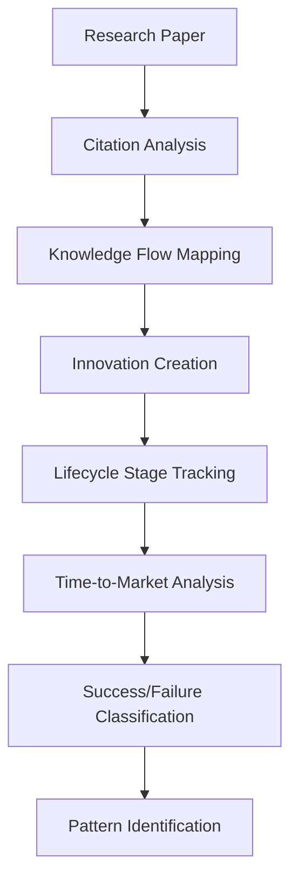
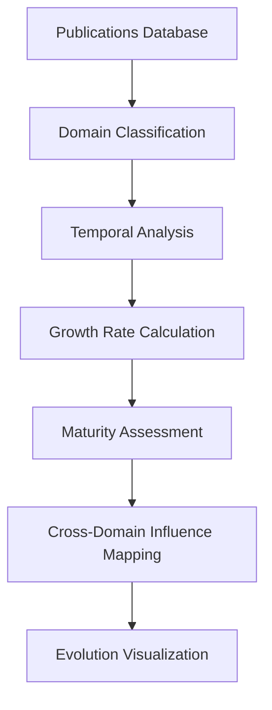
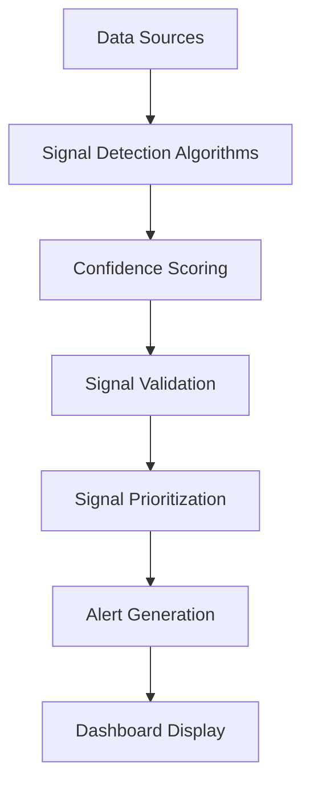
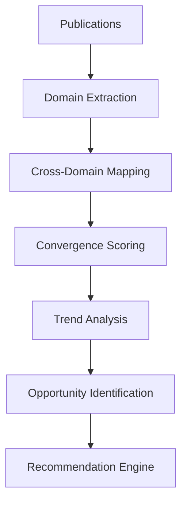

# TAIFA-FIALA Phase 2 Implementation Plan

## Overview

This document outlines the implementation plan for Phase 2 of the Citations Expansion Strategy, focusing on two key components:

1. **Historical Trend Analysis** - Tracking innovation lifecycles, domain evolution, success patterns, and failure analysis
2. **Weak Signal Detection** - Identifying emergence indicators, geographic shifts, technology convergence, and funding anomalies

## Component 1: Historical Trend Analysis

### 1.1 Required New Services/Modules

#### InnovationLifecycleTracker Service

- **Purpose**: Track innovations from research paper to market deployment
- **Key Features**:
  - Temporal tracking of innovation stages (research → prototype → pilot → production → scaling)
  - Time-to-market analysis for different domains and regions
  - Success/failure pattern identification based on lifecycle characteristics
  - Integration with existing citation analysis for knowledge flow mapping

#### DomainEvolutionMapper Service

- **Purpose**: Map how AI application areas mature over time
- **Key Features**:
  - Domain taxonomy and classification system
  - Temporal analysis of domain emergence, growth, and maturity
  - Cross-domain influence mapping
  - Regional variation analysis in domain evolution

#### SuccessPatternAnalyzer Service

- **Purpose**: Identify common characteristics of breakthrough innovations
- **Key Features**:
  - Feature extraction from successful innovations
  - Pattern matching and clustering algorithms
  - Predictive modeling for innovation success
  - Collaboration network analysis for successful teams

#### FailurePatternAnalyzer Service

- **Purpose**: Analyze patterns in stalled or abandoned projects
- **Key Features**:
  - Root cause analysis of failed innovations
  - Early warning indicator identification
  - Risk factor correlation analysis
  - Lessons learned documentation system

### 1.2 Database Schema Changes/New Tables

#### innovation_lifecycles Table

```sql
CREATE TABLE innovation_lifecycles (
  id UUID PRIMARY KEY DEFAULT gen_random_uuid(),
  innovation_id UUID REFERENCES innovations(id),
  stage TEXT NOT NULL, -- research, prototype, pilot, production, scaling
  stage_start_date DATE,
  stage_end_date DATE,
  duration_days INTEGER,
  key_milestones JSONB, -- Important events during this stage
  resources_invested JSONB, -- Funding, personnel, equipment
  challenges_encountered JSONB,
  success_indicators JSONB,
  created_at TIMESTAMP WITH TIME ZONE DEFAULT NOW(),
  updated_at TIMESTAMP WITH TIME ZONE DEFAULT NOW()
);
```

#### domain_evolution Table

```sql
CREATE TABLE domain_evolution (
  id UUID PRIMARY KEY DEFAULT gen_random_uuid(),
  domain_name TEXT NOT NULL,
  period_start DATE NOT NULL,
  period_end DATE NOT NULL,
  innovation_count INTEGER DEFAULT 0,
  publication_count INTEGER DEFAULT 0,
  funding_amount DECIMAL(15,2) DEFAULT 0,
  key_players JSONB, -- Leading researchers/institutions
  maturity_level TEXT, -- emerging, growing, mature, declining
  growth_rate DECIMAL(5,2), -- Percentage growth per period
  collaboration_index DECIMAL(5,2), -- Cross-institution collaboration measure
  technology_mix JSONB, -- Dominant technologies in this domain
  geographic_distribution JSONB, -- Regional distribution of activity
  created_at TIMESTAMP WITH TIME ZONE DEFAULT NOW(),
  updated_at TIMESTAMP WITH TIME ZONE DEFAULT NOW()
);
```

#### success_patterns Table

```sql
CREATE TABLE success_patterns (
  id UUID PRIMARY KEY DEFAULT gen_random_uuid(),
  pattern_name TEXT NOT NULL,
  pattern_description TEXT,
  pattern_type TEXT, -- technical, organizational, funding, market
  associated_features JSONB, -- Key features that define this pattern
  success_rate DECIMAL(5,2), -- Percentage of innovations with this pattern that succeed
  domain_specific BOOLEAN DEFAULT FALSE,
  geographic_scope TEXT, -- Global or specific regions
  temporal_scope TEXT, -- Time periods where this pattern is most effective
  supporting_evidence JSONB, -- Case studies, research papers, statistics
  confidence_score DECIMAL(3,2), -- Algorithm confidence in this pattern
  last_validated DATE,
  created_at TIMESTAMP WITH TIME ZONE DEFAULT NOW(),
  updated_at TIMESTAMP WITH TIME ZONE DEFAULT NOW()
);
```

#### failure_patterns Table

```sql
CREATE TABLE failure_patterns (
  id UUID PRIMARY KEY DEFAULT gen_random_uuid(),
  pattern_name TEXT NOT NULL,
  pattern_description TEXT,
  failure_category TEXT, -- technical, market, funding, organizational
  root_causes JSONB, -- Primary causes of failure
  early_indicators JSONB, -- Warning signs that appear before failure
  mitigation_strategies JSONB, -- Recommended approaches to avoid this failure
  associated_domains TEXT[], -- Domains where this failure pattern is common
  geographic_prevalence JSONB, -- Regional occurrence rates
  temporal_patterns JSONB, -- When in the lifecycle this failure typically occurs
  supporting_evidence JSONB, -- Case studies, research papers, statistics
  confidence_score DECIMAL(3,2), -- Algorithm confidence in this pattern
  created_at TIMESTAMP WITH TIME ZONE DEFAULT NOW(),
  updated_at TIMESTAMP WITH TIME ZONE DEFAULT NOW()
);
```

### 1.3 API Endpoints

#### Lifecycle Tracking Endpoints

```
GET /api/trends/lifecycles
GET /api/trends/lifecycles/{innovation_id}
POST /api/trends/lifecycles
PUT /api/trends/lifecycles/{innovation_id}
DELETE /api/trends/lifecycles/{innovation_id}
```

#### Domain Evolution Endpoints

```
GET /api/trends/domains
GET /api/trends/domains/{domain_name}
GET /api/trends/domains/evolution
POST /api/trends/domains/analysis
```

#### Pattern Analysis Endpoints

```
GET /api/trends/patterns/success
GET /api/trends/patterns/failure
GET /api/trends/patterns/recommendations
POST /api/trends/patterns/analyze
```

### 1.4 Integration Points with Existing Services

1. **Citations Analysis Service**:

   - Use existing citation networks to trace knowledge flow from research to innovation
   - Leverage impact scoring for identifying influential research that leads to successful innovations
   - Integrate with knowledge flow mapping to understand research-to-innovation pathways

2. **Enhanced Publication Service**:

   - Utilize development stage detection for lifecycle tracking
   - Use business model extraction for success pattern analysis
   - Leverage technology extraction for domain evolution mapping

3. **Vector Service**:
   - Use semantic similarity for pattern matching
   - Apply clustering algorithms for grouping similar innovations
   - Implement anomaly detection for identifying outliers

### 1.5 Data Flow Diagrams

#### Innovation Lifecycle Tracking Flow



#### Domain Evolution Analysis Flow



## Component 2: Weak Signal Detection

### 2.1 Required New Services/Modules

#### EmergenceIndicatorDetector Service

- **Purpose**: Identify early signs of new AI application areas
- **Key Features**:
  - Novel terminology detection in publications
  - Unusual collaboration pattern recognition
  - Funding spike detection in new domains
  - Geographic emergence tracking

#### GeographicShiftTracker Service

- **Purpose**: Monitor innovation activity migrating between countries/regions
- **Key Features**:
  - Regional activity heat maps
  - Migration pattern analysis
  - Policy impact assessment
  - Infrastructure correlation analysis

#### TechnologyConvergenceAnalyzer Service

- **Purpose**: Analyze AI combining with other domains
- **Key Features**:
  - Cross-domain technology mapping
  - Convergence rate measurement
  - Hybrid innovation identification
  - Interdisciplinary collaboration tracking

#### FundingAnomalyDetector Service

- **Purpose**: Identify unusual investment activity signaling opportunities
- **Key Features**:
  - Funding pattern deviation detection
  - Investment concentration analysis
  - Funding gap identification
  - Early-stage investment tracking

### 2.2 Database Schema Changes/New Tables

#### weak_signals Table

```sql
CREATE TABLE weak_signals (
  id UUID PRIMARY KEY DEFAULT gen_random_uuid(),
  signal_type TEXT NOT NULL, -- emergence, geographic_shift, convergence, funding_anomaly
  signal_name TEXT NOT NULL,
  description TEXT,
  detection_date DATE NOT NULL,
  confidence_score DECIMAL(3,2),
  evidence_sources JSONB, -- Publications, news, funding announcements
  geographic_scope TEXT[], -- Relevant regions/countries
  temporal_scope JSONB, -- Time period of relevance
  domain_relevance TEXT[], -- Relevant AI domains
  potential_impact TEXT, -- Description of possible future implications
  related_signals UUID[], -- References to other related signals
  validation_status TEXT DEFAULT 'pending', -- pending, validated, dismissed
  validation_notes TEXT,
  created_at TIMESTAMP WITH TIME ZONE DEFAULT NOW(),
  updated_at TIMESTAMP WITH TIME ZONE DEFAULT NOW()
);
```

#### emergence_indicators Table

```sql
CREATE TABLE emergence_indicators (
  id UUID PRIMARY KEY DEFAULT gen_random_uuid(),
  indicator_type TEXT NOT NULL, -- terminology, collaboration, funding, geographic
  indicator_value TEXT NOT NULL,
  detection_method TEXT, -- algorithm, manual, ml_model
  detection_date DATE NOT NULL,
  confidence_score DECIMAL(3,2),
  associated_domain TEXT,
  geographic_context TEXT,
  temporal_context TEXT, -- Time period when indicator was observed
  supporting_evidence JSONB, -- Links to publications, news, data
  validation_status TEXT DEFAULT 'pending',
  created_at TIMESTAMP WITH TIME ZONE DEFAULT NOW(),
  updated_at TIMESTAMP WITH TIME ZONE DEFAULT NOW()
);
```

#### convergence_analysis Table

```sql
CREATE TABLE convergence_analysis (
  id UUID PRIMARY KEY DEFAULT gen_random_uuid(),
  domain_a TEXT NOT NULL,
  domain_b TEXT NOT NULL,
  convergence_type TEXT, -- methodological, application, data, infrastructure
  convergence_strength DECIMAL(3,2),
  first_observed DATE,
  examples JSONB, -- Case studies of convergence
  key_researchers JSONB, -- Researchers working in this convergence area
  publications_count INTEGER DEFAULT 0,
  funding_trends JSONB,
  created_at TIMESTAMP WITH TIME ZONE DEFAULT NOW(),
  updated_at TIMESTAMP WITH TIME ZONE DEFAULT NOW()
);
```

### 2.3 API Endpoints

#### Weak Signal Detection Endpoints

```
GET /api/signals
GET /api/signals/{signal_id}
POST /api/signals/detect
GET /api/signals/emergence
GET /api/signals/geographic
GET /api/signals/convergence
GET /api/signals/funding-anomalies
```

#### Pattern Analysis Endpoints

```
GET /api/signals/patterns
POST /api/signals/patterns/analyze
GET /api/signals/recommendations
```

### 2.4 Integration Points with Existing Services

1. **Enhanced Publication Service**:

   - Use technology extraction for emergence indicator detection
   - Leverage institutional connection mapping for geographic shift tracking
   - Apply business model analysis for funding anomaly detection

2. **News Monitoring Service**:

   - Integrate with RSS monitoring for weak signal detection in news
   - Use article clustering for identifying convergence patterns
   - Apply sentiment analysis for funding anomaly detection

3. **Citation Analysis Service**:
   - Use citation network analysis for identifying emerging research areas
   - Apply knowledge flow mapping for tracking technology convergence
   - Leverage impact scoring for prioritizing weak signals

### 2.5 Data Flow Diagrams

#### Weak Signal Detection Flow



#### Technology Convergence Analysis Flow



## Technical Requirements

### Graph Database Integration

- **Purpose**: For relationship mapping between entities
- **Implementation**:
  - Use existing Supabase PostgreSQL with graph-like queries
  - Implement materialized views for common relationship patterns
  - Create specialized relationship tables for complex mappings
  - Utilize JSONB fields for flexible relationship data

### Time-Series Analysis Capabilities

- **Purpose**: For temporal pattern detection and trend analysis
- **Implementation**:
  - Leverage PostgreSQL time-series functions
  - Implement custom aggregation functions for trend analysis
  - Create time-series materialized views for performance
  - Use window functions for moving averages and trend detection

### Clustering Algorithms for Pattern Detection

- **Purpose**: For identifying similar innovations and research themes
- **Implementation**:
  - Use scikit-learn for clustering algorithms (will need to add to requirements)
  - Implement K-means, DBSCAN, and hierarchical clustering
  - Create feature extraction pipelines for different data types
  - Develop similarity scoring mechanisms

### Notification System for Real-Time Alerting

- **Purpose**: For alerting users to important weak signals and trends
- **Implementation**:
  - Use Supabase real-time features for push notifications
  - Implement email notification system
  - Create webhook system for third-party integrations
  - Develop in-app notification center

## Implementation Priority Order

### Phase 1 (High Priority - Dependencies: Low)

1. Database schema extensions for lifecycle tracking
2. Basic innovation lifecycle tracking service
3. Simple domain evolution mapping
4. Core API endpoints for trend analysis

### Phase 2 (Medium Priority - Dependencies: Phase 1)

1. Advanced pattern detection algorithms
2. Weak signal detection services
3. Technology convergence analysis
4. Geographic shift tracking

### Phase 3 (Low Priority - Dependencies: Phase 2)

1. Predictive modeling for success/failure
2. Advanced notification and alerting system
3. Integration with machine learning models
4. Real-time dashboard updates

## Estimated Effort

### Component 1: Historical Trend Analysis

- Database schema changes: 2 days
- InnovationLifecycleTracker Service: 5 days
- DomainEvolutionMapper Service: 4 days
- SuccessPatternAnalyzer Service: 6 days
- FailurePatternAnalyzer Service: 5 days
- API endpoints: 3 days
- Testing and integration: 5 days
- **Total: 30 days**

### Component 2: Weak Signal Detection

- Database schema changes: 2 days
- EmergenceIndicatorDetector Service: 4 days
- GeographicShiftTracker Service: 3 days
- TechnologyConvergenceAnalyzer Service: 5 days
- FundingAnomalyDetector Service: 4 days
- API endpoints: 2 days
- Testing and integration: 4 days
- **Total: 24 days**

### Additional Technical Requirements

- Graph database integration: 3 days
- Time-series analysis capabilities: 4 days
- Clustering algorithms implementation: 5 days
- Notification system: 3 days
- **Total: 15 days**

### **Overall Estimated Effort: 69 days (approximately 3 months)**

## Testing Strategy

### Unit Testing

- Test each service method with mock data
- Verify database schema constraints
- Test API endpoint responses
- Validate data transformation logic

### Integration Testing

- Test service-to-service communication
- Verify database relationship integrity
- Test API endpoint integration with services
- Validate real-time notification systems

### Performance Testing

- Load testing for API endpoints
- Database query performance testing
- Clustering algorithm performance testing
- Time-series analysis performance testing

### User Acceptance Testing

- Dashboard visualization accuracy
- Alert relevance and timing
- Pattern detection accuracy
- Ease of use for trend analysis

## Conclusion

This implementation plan provides a comprehensive roadmap for Phase 2 of the Citations Expansion Strategy. By implementing Historical Trend Analysis and Weak Signal Detection capabilities, TAIFA-FIALA will be able to provide deeper insights into the African AI innovation ecosystem, helping stakeholders make more informed decisions and identify emerging opportunities.
